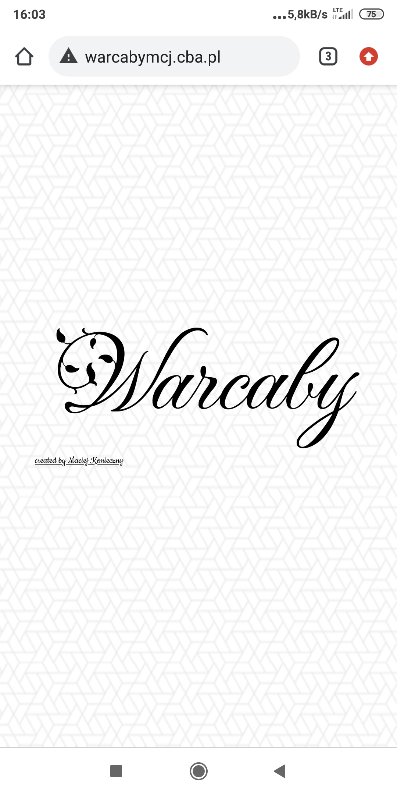
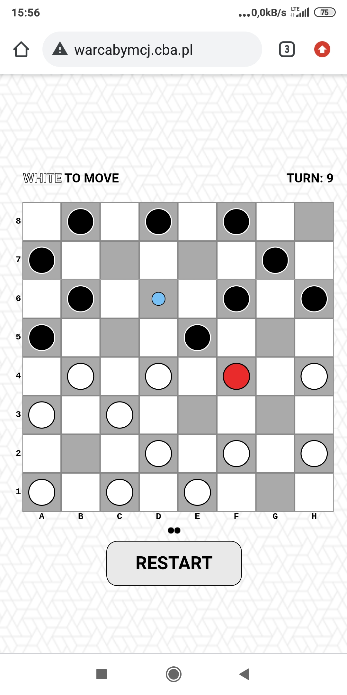
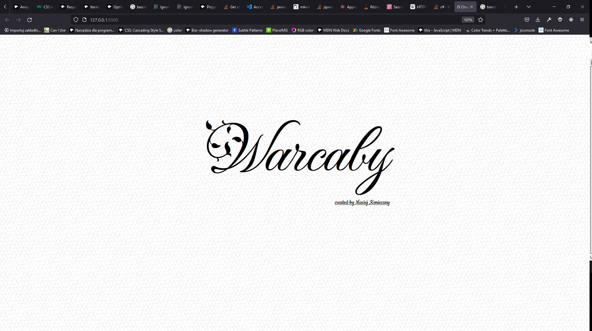
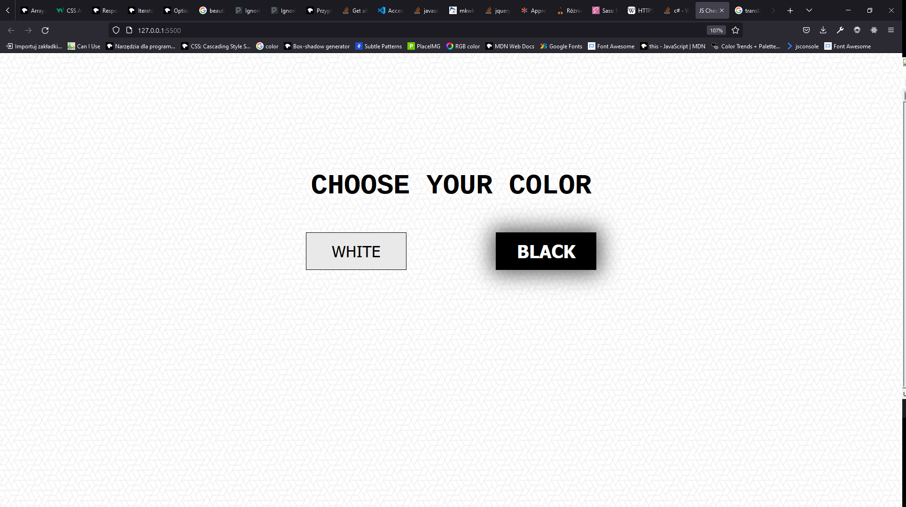
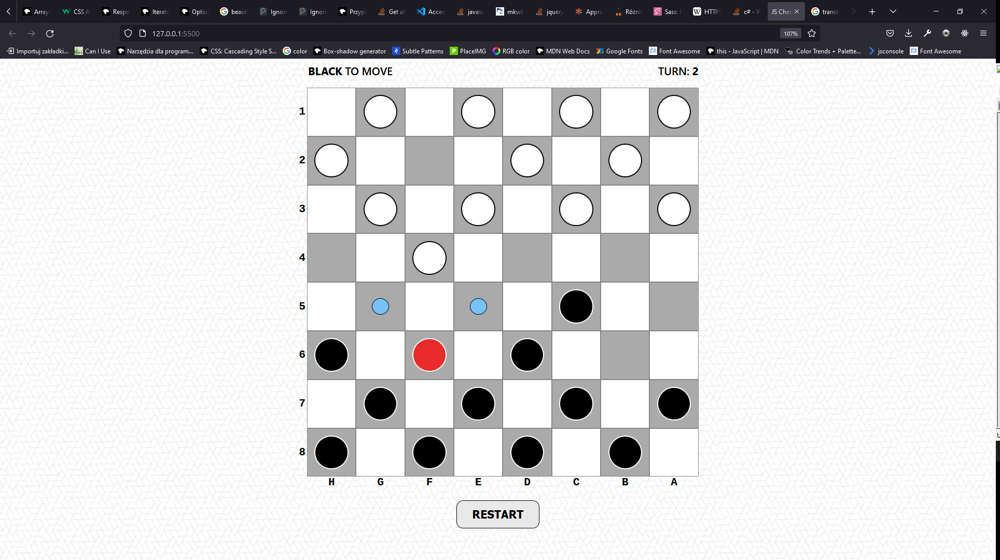

# jsCheckers
> Simple responsive webpage, where you can play checkers with computer opponent. Available at https://ifmcjthenknczny.github.io/jsCheckers/.

## Table of contents
* [General info](#general-info)
* [Screenshots](#screenshots)
* [Technologies](#technologies)
* [Setup](#setup)
* [Features](#features)
* [Status](#status)
* [Inspiration](#inspiration)
* [Contact](#contact)

## General info
This responsive single-page application allows you to play checkers on 8x8 board with a computer opponent. AI is very basic - computer picks random move from the list of available moves.

[Background source](https://www.toptal.com/designers/subtlepatterns/what-the-hex/)

## Screenshots

## Technologies
* HTML5
* Sass
* Vanilla Javascript

## Setup
No setup needed. Just make sure you don't use Internet Explorer. For Android, Google Chrome is recommended.

## Features
* All rules of checkers implemented.
* Ready for different board sizes.
* Cheats: AEZAKMI, NUTTERTOOLS, ASPIRINE.

* Capture obligation (but not necessarily best one).
* Possibility of choosing piece color.
* Display of possible moves of given piece.

* Responsive for mobile and laptop (breakpoint: 700px)
* Captured pieces go to separate, visible area - "graveyard".
* Turn counter and displaying whose turn is it.
* Game reset button.

* Smooth transition of pieces and between windows.
* Displaying possible captures in case of chained capture before animation finishes.

* Board and surroundings fully generated from scratch with use of Javascript.

To-do list:
* Responsiveness improvement: justifying and aligning.
* Code readibility and code quality improvement.
* SEO
* Implementing visual board size choose window.
* Computer AI slight improvment (concerning queen moves and best captures)
* Sudden death cheat (1vs1)
## Status
Project is: _in progress_

## Inspiration
Project inspired by my chess passion. I wanted to created something in spite of it and to practice my Javascript.

## Contact
Created purely by Maciej Konieczny.
